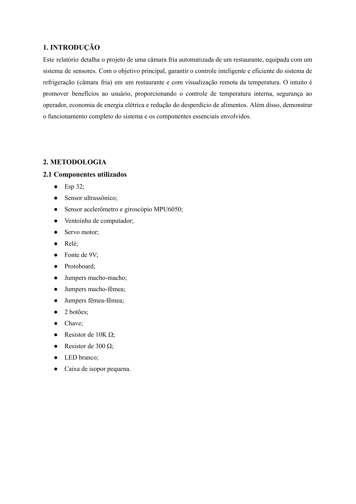
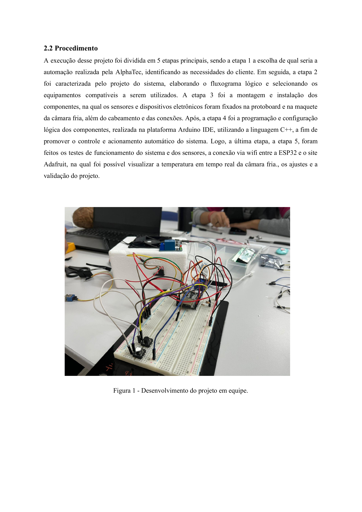
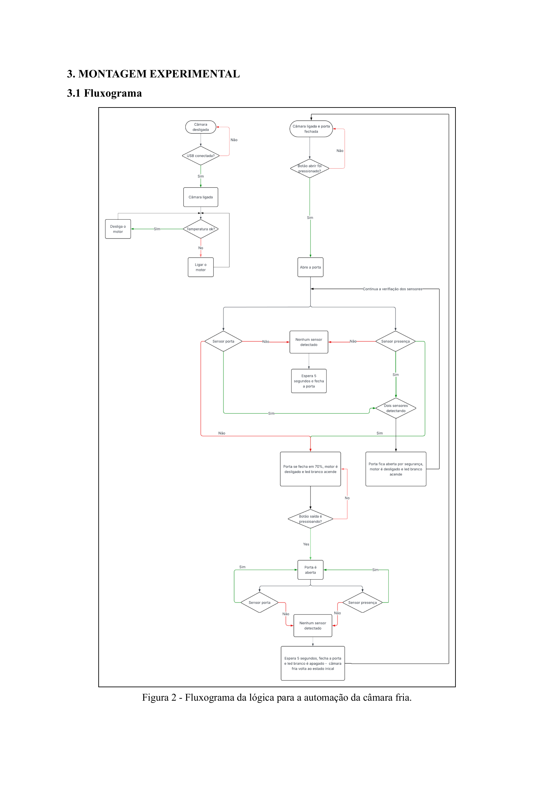
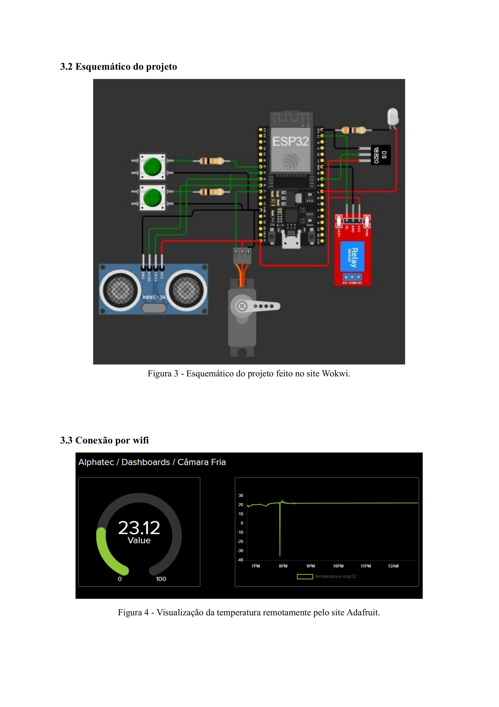
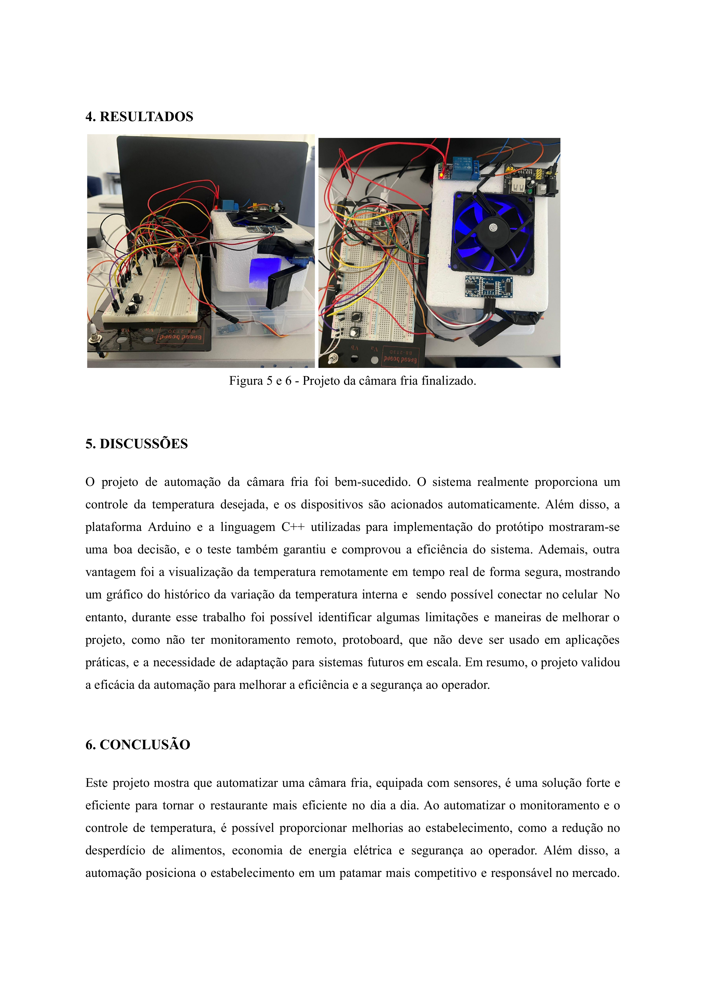

# ECOP11A-Projeto-Final Introdução a Engenharia e Metodo Cientifico
Introdução a Programação: Projeto Final. Introdução a Engenharia

# ❄️ Projeto Final - Automação de Câmara Fria | Alphatec

## 👩‍💻 Equipe
- Ana Cristina Meira dos Santos  
- Beatriz de Paula Piotto  
- Gabriel de Souza  
- João Henrique Avelar  
- Jonas Emanuel Soares de Souza  

---

## 📌 Objetivo

Desenvolver um sistema de **automação para câmara fria** de um restaurante, utilizando sensores e conectividade remota para:

- Monitorar a temperatura interna  
- Acionar dispositivos automaticamente  
- Promover economia de energia elétrica  
- Aumentar a segurança do operador  
- Reduzir o desperdício de alimentos  

---

## 🛠️ Componentes Utilizados

- ESP32  
- Sensor ultrassônico  
- Sensor MPU6050 (acelerômetro + giroscópio)  
- Ventoinha  
- Servo motor  
- Relé  
- Fonte 9V  
- Protoboard  
- Fios jumper (macho-macho, macho-fêmea, fêmea-fêmea)  
- 2 botões  
- Chave  
- Resistores: 10kΩ e 300Ω  
- LED branco  
- Caixa de isopor (câmara fria simulada)

---

## ⚙️ Metodologia

1. Escolha do sistema a ser automatizado  
2. Projeto da lógica e seleção dos componentes  
3. Montagem dos sensores e atuadores na maquete  
4. Programação com C++ na plataforma Arduino IDE  
5. Testes e conexão com a nuvem (Adafruit IO)  

---

## 🧠 Fluxograma do Sistema

---

## 🔌 Esquemático do Circuito

---

## 📡 Conectividade com Adafruit IO

---

## ✅ Resultados

  

---

## 💬 Discussões

- O sistema se mostrou eficiente e seguro  
- C++ e Arduino IDE foram escolhas adequadas para a lógica  
- Limitações:
  - Protoboard não é recomendada para produção
  - Melhorias futuras devem incluir um sistema mais robusto para monitoramento remoto

---

## 🏁 Conclusão

A automação da câmara fria mostrou ser uma solução prática e eficiente para restaurantes, trazendo benefícios como economia, segurança e modernização do serviço. Projetos como esse posicionam o negócio em um nível mais competitivo e sustentável no mercado atual.

** Objetivo
tralala lalala um dois três batatinha...

** Diagrama em blocos

